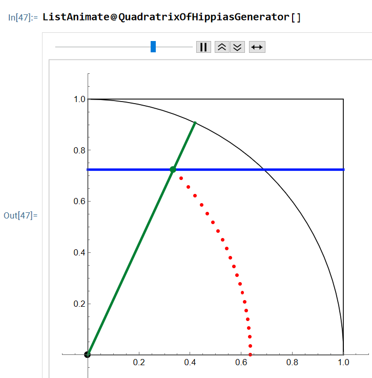

PlaneCurveGenerator.wl
is a package for Wolfram language / Mathematica.

This package exports about 30 functions that generate animations showing various ways to trace special plane curves.

A typical function looks like

```
EllipseGenerator[]
```

This package is designed to visually demonstrate various properties of special plane curves. 

PlaneCurveGenerator.wl
is the code.

PlaneCurveGenerator_Examples.nb
is the documentation.

All exported symbols are fully documented. e.g.
Type
?name
for documentation.

Home page url:
http://xahlee.info/M/plane_curve_generator.html

This package is sponsored by Wolfram Research.

# gallery





